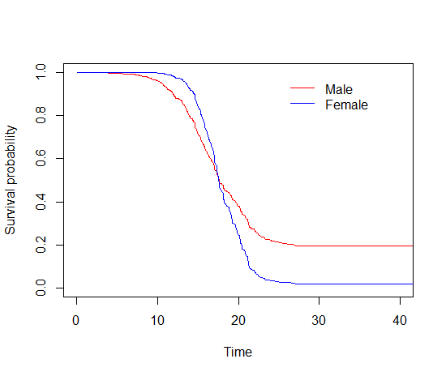

# fhc
fhc is an R package to fit a flexible-hazards cure (FHC) model and a
proportional hazards cure (PHC) model for right-censored survival data
with a cure fraction. The cure fraction can be detected by the stable
plateau of the overall Kaplan-Meier curve's right tail. Besides fitting an FHC or
PHC model, we can also use this package to estimate a cure rate and a
survival function for a group of patients with specified characteristics
based on the fitted model. <br />

The corresponding methodology paper is <br />
Xie, C., Huang, X., Li, R., & Pisters, P. W. T. (2022). A flexible-hazards cure model with application to patients with soft tissue sarcoma. Statistics in Medicine, 41(29), 5698–5714. https://doi.org/10.1002/sim.9588

## What is an FHC model

Our proposed FHC model is in the form of the promotion time cure model
and an extension of the PHC model. It can simultaneously incorporate PH
effects for some covariates and non-PH effects (including crossing
survival curves) for other covariates. This property of the FHC model
provides flexibility to covariates' effects via the hazard functions in
settings with a cure potential. <br />

Under a PHC model, the survival function of time $T$ conditional on a
vector of covariates $\boldsymbol{z}$ can be expressed as 

$$
 S(t|\boldsymbol{z})=\exp\left\\{-e^{\beta_0}e^{\boldsymbol{z'\beta}}F_0(t)\right\\},
$$ 

where $\beta_0$ is an unknown scalar; 
$\boldsymbol{\beta}$ is a
vector of unknown regression coefficients; 
and $F_0(t)$ is a standardized baseline cumulative hazard function with the following
properties: (1) it is monotone increasing with $F_0(0)=0$ and
$\lim_{t \to \infty}F_0(t)=1$; (2) it can be considered as the
cumulative hazard function when all the covariates are equal to 0.<br />

The survival function of an FHC model at time $T$ conditional on 
covariate vectors 
$\boldsymbol{x}$ and $\boldsymbol{z}$ is expressed as 

$$
S(t|\boldsymbol{x},\boldsymbol{z})=\exp\left[-e^{\beta_0}e^{\boldsymbol{z'\beta}}\\{F_0(t)\\}^{\exp(\boldsymbol{x'\gamma})}\right],
$$ 

where $\boldsymbol{\beta}$ 
and $\boldsymbol{\gamma}$ 
are unknown
regression coefficients with dimensions $p$ and $q$, respectively.
$\boldsymbol{x}$ and $\boldsymbol{z}$ are regarded as short- and
long-term covariates, respectively.

## How to get started

Install the R package using the following commands on the R console:

```{r}
install.packages("devtools")
devtools::install_github("cxie19/fhc")
library(fhc)
```

An example data set called *fhc_dat* is provided in this package. It
contains a proportion of cured patients and tied event times. Its
documentation can be seen by using the following command.

```{r}
help(fhc_dat)
```

The function *fhcmodel* is called to fit an FHC model or a PHC model. Its
documentation can be seen by using the following command.

```{r}
help(fhcmodel)
```

The function *estcure* is called to compute a cure rate for a group of
patients with specified characteristics given a fitted FHC or PHC model.
Its documentation can be seen by using the following command.

```{r}
help(estcure)
```

The function *estsurvival* is called to obtain an estimated survival
function for a group of patients with specified characteristics given a
fitted FHC or PHC model. Its documentation can be seen by using the
following command.

```{r}
help(estsurvival)
```

## Examples

### Example of fitting an FHC model

For example, we want to fit an FHC model with covariates age and sex as
both short- and long-term covariates. We call the function *fhcmodel*,
and the following command is used.

```{r}
result <- fhcmodel(data=fhc_dat,event_status = "event",event_time="time",id="id",beta_variable = c("age","sex"), 
                   gamma_variable = c("age","sex"),se=F)
```

After fitting the model, we can compute the cure rates for males and
females given the overall mean of the covariate age. We call the function
*estcure*, and the following commands are used.

```{r}
estcure(object=result,z_value=c(mean(fhc_dat$age),0)) # male
estcure(object=result,z_value=c(mean(fhc_dat$age),1)) # female
```

Given the covariate age as its overall mean, the cure rates of males and
females are 19.62% and 2.01%, respectively.<br /> Meanwhile, we estimate
the survival functions of these two subgroups of patients and draw their
estimated survival curves.

```{r}
survival_male <- estsurvival(object=result,z_value=c(mean(fhc_dat$age),0),x_value=c(mean(fhc_dat$age),0),event_time="time")
survival_female <- estsurvival(object=result,z_value=c(mean(fhc_dat$age),1),x_value=c(mean(fhc_dat$age),1),event_time="time")
plot(survival_male$time,survival_male$survival,ylim=c(0,1),xlim=c(0,40),xlab="Time",ylab="Survival probability",type="l",col="red")
lines(survival_female$time,survival_female$survival,col="blue")
legend(25,1,c("Male","Female"),cex=1,lty=c(1,1),col=c("red","blue"),horiz=F,bty="n")
```



### Example of fitting a PHC model

Similarly, we can fit a PHC model, which can be considered as an FHC
model without $\boldsymbol{\gamma}$ or short-term regression parameters.
The same R commands can be used to obtain estimated cure rates. While
obtaining estimated survival functions, the argument x_value is not
needed in the function *estsurvival*.

```{r}
result <- fhcmodel(data=fhc_dat,event_status = "event",event_time="time",id="id",beta_variable = c("age","sex"))
```
